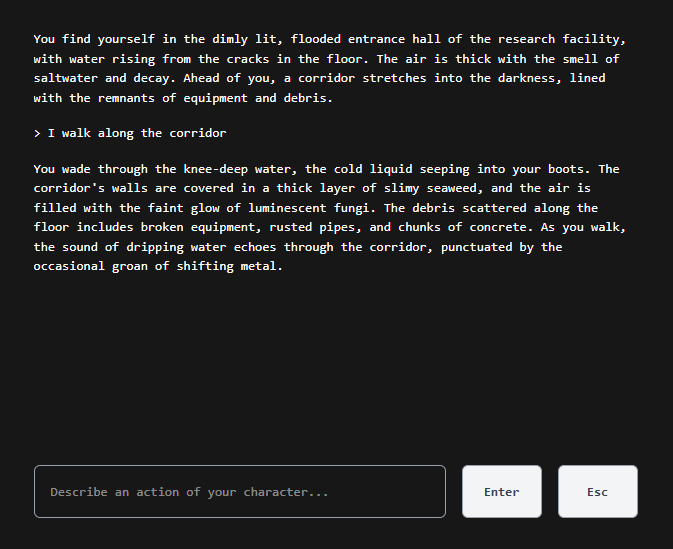

# 🧙‍♂️ GenAI Text Adventure

> **An infinite, AI-powered text adventure game where the story never plays the same way twice.**

## 📖 About The Project

This project explores the capabilities of Generative AI in interactive storytelling. Unlike traditional text adventures with pre-written paths, this game uses a Large Language Model (LLM) to act as a dynamic gamemaster.

### How it works
1.  **World Generation:** Upon starting a new game, the AI generates a completely unique setting, backstory, and victory condition.
2.  **The Loop:** You type actions in natural language (e.g., *"I inspect the glowing rune"* or *"I try to talk my way out of this"*).
3.  **The Outcome:** The AI analyzes your action, describes the outcome, and automatically updates the world state and your inventory.

### Screenshot



## 🛠️ Tech Stack

*   **Backend:** Python, FastAPI, `uv`, Langchain, Pytest
*   **Frontend:** Next.js, Tailwind CSS, TypeScript, `pnpm`

## 🚀 Getting Started

Follow these instructions to set up the project locally for development.

### Prerequisites

Before you begin, ensure you have [uv](https://github.com/astral-sh/uv) and [pnpm](https://pnpm.io/) installed.

You will also need an API from Groq. Create it [here](https://console.groq.com/).

### 1. Backend Setup

The backend handles the AI interaction and game state.

```bash
cd backend/app
uv sync
uv run fastapi dev src/main.py
```

When the server starts, it will prompt you in the terminal to enter your Groq API Key. Paste it in and press Enter.

### 2. Frontend Setup

The frontend provides a user interface with terminal styling.

```bash
cd frontend/app
pnpm install
pnpm run dev
```

Open your browser and visit [http://localhost:3000/](http://localhost:3000/).

## Deployment to an AWS account

Deploy the game to an AWS account with

- [Steps for backend deployment](backend/infra/README.md)
- [Steps for frontend deployment](frontend/infra/README.md)


## 📄 License

Distributed under the [MIT License](LICENSE.md).